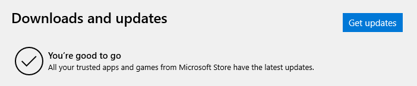

# 在英国学英语

==liner== 内衬

---

==film==

- `n.` 影片；胶卷；**膜**
  （食品包装很常用这个词）
- `v.` 拍电影；蒙上薄膜

---

==bag==

超市结账时问你要不要袋子用的就是 bag

---

==chill==

- `n.` 寒意
- `v.` 使寒冷，使恐怖；（非正式）**放松，休息**（[Urban Dict](https://www.urbandictionary.com/define.php?term=chilling)）

---

==counter==

- `n.` 计数器；（商店、银行等的）**柜台**
- `v.` 反驳；抵制；抵消
- `adj./adv.` 相反的/地，反对的/地
  （😏 MOBA 游戏的 BP 环节中有 counter pick 的说法）

---

==call==

- `v.` 喊，叫；打电话；**到，访问**（车站时刻表上常见）
- `n.` ...

---

==express==

- `v.` 表达，表示
- `n.` **特快列车，快递服务**
- `adj.` **特快的，快速的**

---

往（银行/会员等）卡里**存钱**是 save money
但表示**充值**用 top-up
充了钱，储蓄或余额叫 savings

::: details 眼见为实

:::

---

==I'm good==

除了用来回复 How are you? 之外，常用于

― Do you want some chips with your sandwich?
― No, I'm good. Thanks.
（我听到过 I'm alright）
（另：<https://forum.wordreference.com/threads/no-thanks-im-good.1539125/#post-7757200>）

― Do you have any questions?
― No, I'm good.

也可用作委婉拒绝。

― Do you wanna go to a strip club?
― I'm good.

<https://www.zhihu.com/question/32071242/answer/57430203>

---

==You're good (to go) / You're all set==

你的事情都办好了

::: details 眼见为实

:::

问法可以是 Am I all set?

---

==till==

- `prep./conj.` 直到（utill 的非正式形式）
- `n.` **收银台，（现金出纳机的）放钱的抽屉**（A cash register or drawer for money in a shop, bank, or restaurant）
- `v.` 耕作，犁地

---

==attraction==

- `n.` 吸引；吸引力；**A place which draws visitors by providing something of interest or pleasure**

---

==quote==

- `v./n.` 引用；**报价**

travel insurance quotes

---

==北约音标字母==

打电话需要报字母的时候会用到（比如给银行打电话需要报名字，邮编等）

比如 B - Bravo
注意 [Z 的读音](/english/be-vs-ae#z)（听到过 Z - Zet）

[说 26 个英文字母时用单词怎么表达？ - 栗子的回答 - 知乎](https://www.zhihu.com/question/19737171/answer/200385911)
[北约音标字母 - 维基百科](https://zh.wikipedia.org/zh-cn/北约音标字母)

---

==serve==

- `v.` 服务；提供；**发球**
- `n.` **发球**
