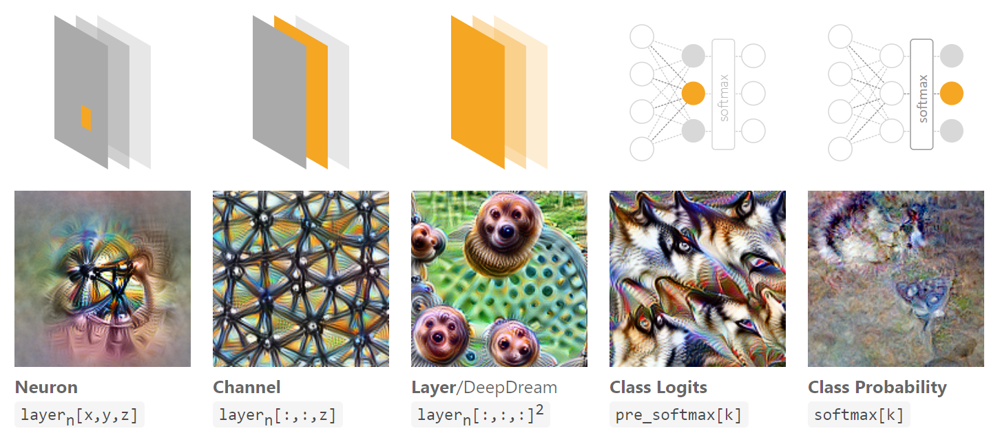
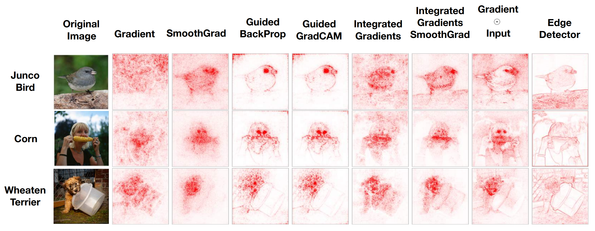
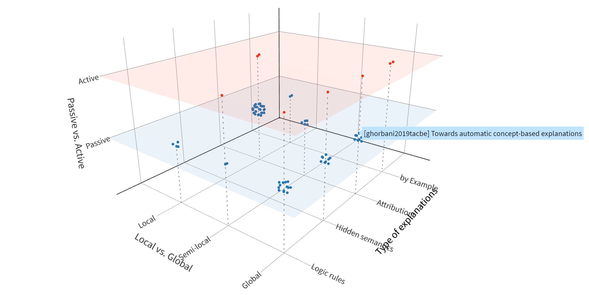

# 神经网络可解释性综述

<link rel="stylesheet" href="/notes/katex.min.css">

## 前言

从 2017 年底就开始调研神经网络可解释性方面的研究了，但是由于各种原因一直拖拖拖到最近才正式放到网上。尤其今年看到许多新的工作都逐渐填补了从我们的论文归纳中能明显发现的空白部分，感觉我们的思考还是有一些分享价值的，就当抛砖引玉了（也可以阅读 [arXiv 版本](https://arxiv.org/abs/2012.14261)或[知乎文章](https://zhuanlan.zhihu.com/p/341153242)）

多说一点题外话，因为可解释性的研究比较杂乱，刚开始调研的时候只好使用暴力搜索来寻找相关的文章，直观地体会到了这一波深度学习热潮让多少会议的论文数量大增😂

<figure>
  
</figure>

## What. 什么是可解释性

<!-- 区分学习理论 -->

从主流的学术研究来说，==可解释性== **(interpretability)** 这个词主要是指解释 **具体的 / 已经训练好的网络**。但是在日常说法中，对深度学习理论的研究也常被称为 **深度学习的可解释性**。两者的差别在于**解释的对象**，其中后者想解释的是**深度学习这套方法**（为什么这么好用）。本文我们只关注前者——具体的网络的可解释性，不过在文章的最后也顺便介绍一些与后者相关的内容。

<figure>
  
</figure>

一个具体的神经网络无非是一个从输入 $x$ 到输出 $y$ 的非线性映射，可解释性就是想理解这个映射背后的「思路 / 逻辑 / rationale」，而不是仅仅知道该结果是怎么经过一堆意义不明的数值（权值）计算出来的。我们采用以往论文中提到的一种释义，

> **Interpretability** is the ability to provide *explanations*1 in *understandable terms*2 to a human.
> ⸺ F. Doshi-Velez and B. Kim, “Towards A Rigorous Science of Interpretable Machine Learning”, <em>arXiv</em>, 2017.

其中我们**额外强调两点**：

1. **解释 explanations**，说到底是需要用某种「语言」来描述的（自然语言，逻辑语句等等）。理想情况下当然使用逻辑规则的形式最清晰，但是实践上人们往往不强求「完整的解释」，只要能提供一定程度的信息，剩下的可以靠自己脑补（因此产生了许多不同类型的解释，比如 saliency maps）

2. **可理解的术语 understandable terms**，是构成解释的基本单元。不同领域的模型的解释需要建立在不同的领域术语之上，比如
   

简单来说，我们尤其关注可解释性中 **解释 (explanation)** 的角色。虽然解释的形式有很多种，但它们终归可以显式或隐式地表达成逻辑规则的形式（这会成为后面一个重要的论文分类维度）

## Why. 为什么需要可解释性

为什么需要可解释性这个问题也有许多不同的说法。一个最常见的讨论就是 **信任 (trust)** 问题，不过信任本身还受很多主观因素影响，难以讨论出什么结果。通过对相关文献的总结，我们可以把各种理由拆解归纳为 3 类：

- **高可靠性要求**
  神经网络在实际使用中经常被发现有一些意想不到的错误（更不用说对抗攻击），这对一些要求高可靠性的系统来说就很危险了（不信任）。可解释性可能有助于发现潜在的错误（比如发现模型逻辑和 domain knowledge 不相符），也可能可以帮助 debug，改进模型

- **伦理 / 法规要求**
  药物设计，医疗器械，需要 FDA 批准；欧盟 GDPR (right to explanation)

- **作为其它科学研究的工具**
  科学研究是为了发现新知识。如果神经网络在某些科学问题上效果很好，那说明其可能发现了某种新「知识」，可解释性可以用来揭示它

## How. 可解释性论文分类维度

终于到了最重要的部分——可解释性研究的现状。之前的综述文章的分类往往依赖于一些 pre-recognized interpretable **explanator**s（比如决策树，决策集，saliency maps，linear proxy model，feature importance 等等），但是各种 explanator 之间的关系很混乱（有些相互包含，有些根本不在一个层面上）。一个好的综述应该能为该研究领域提供一个「坐标系」——包括一系列正交的分类维度。对于可解释性研究，我们认为有 3 个维度（虽然许多内容在以往的论文中都有提及，但是都不完整）：

- **Passive (post hoc) vs. Active (intervention)**，事后解释 vs. 主动干预
  ——是否在模型的架构设计或者训练过程中进行干预

- **Type/Format of Explanations**，所产生的解释的表现形式
  基本都能归纳为 4 类（解释完整程度递减）：
  - Logic rule，包括决策树和决策集 (decision sets) 等
  - Hidden semantics，解释神经网络内部的某一部分（比如可视化某个神经元的激活模式）
  - Attribution，不知道怎么翻译好，直观的例子就是 saliency maps 或者 feature importance
  - By examples，比如直接返回一个训练集里的样本作为解释

- **Local-Semilocal-Global** (w.r.t. the input space)，是解释单独的输入还是整个模型

图解版本

<figure>
  
  <figcaption>Type/Format of Explanations</figcaption>
</figure>

<figure>
  
  <figcaption>Local vs. Global</figcaption>
</figure>

### Passive (post hoc)

目前大部分的可解释性工作都集中在**事后解释**上，毕竟最直观并且适用范围广。下面我们先分为 Passive 和 Active 两个大章节，然后按**所产生的解释类型**依次列举一些代表性的工作，同时分别用 **[G]**，**[semi-L]** 和 **[L]** 来标识 global/semi-local/local 解释。

#### Rules as explanations (Rule extraction)

- **KT algorithm**，提取命题逻辑规则 [G]
  L. Fu, “Rule Learning by Searching on Adapted Nets”, *AAAI*, 1991.
- 形如 **M-of-N** 的规则 [G]
  G. G. Towell and J. W. Shavlik, “Extracting refined rules from knowledge-based neural networks”, *Machine Learning*, 1993.
- **Gyan**，一阶逻辑规则 [G]
  R. Nayak, “Generating rules with predicates, terms and variables from the pruned neural networks”, *Neural Networks*, 2009.
- 模糊逻辑 [G]
  J. L. Castro et al., “Interpretation of artificial neural networks by means of fuzzy rules”, *IEEE Transactions on Neural Networks*, 2002.
- ……（可以直接用各种决策树学习算法，比如 CART、C4.5，来拟合一个网络的输入输出）
- **Contrastive explanations**，通过扰动一个输入来寻找其哪些部分是必不可少 / 多的 [L]
  A. Dhurandhar et al., “Explanations based on the missing: Towards contrastive explanations with pertinent negatives”, *NeurIPS*, 2018.
  2020 年有一篇 NeurIPS 续作 [G]
- **Anchors** [semi-L]
  M. T. Ribeiro et al., “Anchors: High-precision model-agnostic explanations”, *AAAI*, 2018.
- **Interpretable partial substitute** [semi-L]
  T. Wang, “Gaining free or low-cost interpretability with interpretable partial substitute”, *ICML*, 2019.

#### Explaining hidden semantics

**Hidden semantics** 的主要想法是，既然我们还不能理解整个神经网络，那不如先尝试**理解网络内部的某一部分**（比如某个神经元，某个 channel）。目前主要工作集中在可视化上，思路就是找到一个能最大化某目标（比如某个神经元）输出的 input pattern (activation maximization)。不妨参看 [Feature Visualization](https://distill.pub/2017/feature-visualization/)。

<figure>
  
  <figcaption>C. Olah et al., “Feature visualization”, <em>Distill</em>, 2017.</figcaption>
</figure>

另外介绍一篇 NLP 领域的文章：F. Dalvi et al., “What Is One Grain of Sand in the Desert? Analyzing Individual Neurons in Deep NLP Models”, *AAAI*, 2019.

#### Attribution

**Attribution** is to assign *credit* or *blame* to the input features in terms of their impact on the output (prediction).

<figure>
  
  <figcaption>J. Adebayo et al., “Sanity checks for saliency maps”, <em>NeurIPS</em>, 2018.</figcaption>
</figure>

- **LIME**，**MAPLE**，在局部拟合一个线性函数 [L]
- **Partial derivatives**，**DeconvNet**，**Guided backprop**，**Guided Grad-CAM**，某种意义上的「梯度」[L]
- **DeepLIFT**，**LRP**，**Integrated gradients**，某种意义上的「离散梯度」[semi-L]
- 各种 **Shapley values**，**Sensitivity analysis**，不依赖模型的方法 (model agnostic) [L]
- **TCAV**，**ACE**，在更高层面的 concepts（不再是 input features）上做 attribution [G]
- **SpRAy**，**MAME**，把局部解释「融合」成半局部或全局解释 [semi-L, G]

#### By examples

- **Influence functions**，对于一个测试样本，在训练集里面哪个样本对其影响最大 [L]
  P. W. Koh and P. Liang, “Understanding black-box predictions via influence functions”, *ICML*, 2017.
- **Representer point selection** [L]
  C.-K. Yeh et al., “Representer point selection for explaining deep neural networks”, *NeurIPS*, 2018.

### Active (interpretability intervention)

主要的做法就是在神经网络优化的过程中加入 “interpretability loss”，约束网络使其在某种意义上更可解释。

#### Logic rules

- **(Regional) tree regularization**，使网络更容易被浅的决策树拟合 [semi-L, G]
  M. Wu et al., “Beyond sparsity: Tree regularization of deep models for interpretability”, *AAAI*, 2018.
  M. Wu et al., “Regional tree regularization for interpretability in deep neural networks”, *AAAI*, 2020.

#### Hidden semantics

- 希望每个卷积核都学到独特的 pattern [G]
  Q. Zhang, Y. Nian Wu, and S.-C. Zhu, “Interpretable convolutional neural networks”, *CVPR*, 2018.

#### Attribution

- **ExpO**，希望 local attribution 更好更鲁棒 [L]
  G. Plumb et al., “Regularizing black-box models for improved interpretability”, *NeurIPS*, 2020.
- **DAPr**，希望 attribution 的时候还可以同时考虑一些先验 [L]
  E. Weinberger et al., “Learning deep attribution priors based on prior knowledge”, *NeurIPS*, 2020.
- **Dual-net**，一个网络选择重要的 feature set，另一个训练 [G]
  M. Wojtas and K. Chen, “Feature importance ranking for deep learning”, *NeurIPS*, 2020.

#### By example

- **Prototype layer** [G]
  O. Li et al., “Deep learning for case-based reasoning through prototypes: A neural network that explains its predictions”, *AAAI*, 2018.
  C. Chen et al., “This looks like that: deep learning for interpretable image recognition”, *NeurIPS*, 2019.

## 总结

得益于前面提到的分类维度，我们可以把现有的可解释性论文放到一个三维空间中（访问[在线版](https://yzhang-gh.github.io/tmp-data/index.html)）

<figure>
  
</figure>

不同类别的研究数量有多有少（比如 active 类的方法数量明显少于 passive 类），这里就不多做分析了。不过从近年的趋势来看，一是 active 方法的研究变多了，二是 local 与 global 解释的融合 (multi-level) 研究也在增多。

---

## 扩展：深度学习理论（方法可解释性）

虽然本意只关注针对具体神经网络的可解释性，但是在做文献调研的过程中也看到了许多深度学习理论相关的论文，不如顺便也分享一些粗浅的理解。

深度学习方法的可解释性最核心的一个问题就是「为什么深度神经网络这么好用」，这里的「好」指的是**泛化性能好**。按照传统的认识，深度神经网络参数这么多、表达能力这么强，那应该很容易过拟合而导致泛化性能差才对。对此有很多不同的研究思路。总的来说，学习无非是使用一种优化算法 $\mathcal{A}$ 从假设空间 $\mathcal{H}$ 中寻找出一个假设 $h$（也即一个神经网络），这个寻找的过程可以利用训练集来评估经验误差 $\widehat{E}$，最后希望能最小化在从未见过的测试集上的泛化误差 $E$（的期望值）。所以想要解释为什么深度学习效果好——

- **从假设空间 $\mathcal{H}$ 的角度**，是不是因为深度网络的架构选得很好呢？
  大部分的结论基本都是说，随着网络深度的增加，网络的表达能力指数增加（那么逼近相同的函数时所需要的参数就比浅层网络少，不容易过拟合）
  “The Power of Depth for Feedforward Neural Networks”, *COLT*, 2016.
  “When and Why Are Deep Networks Better Than Shallow Ones?”, *AAAI*, 2017. 等等

- **从优化算法 $\mathcal{A}$ 的角度**，是不是因为优化算法很合适呢？
  一个很流行的说法是，sharp minima 的泛化性能不好，而 (small-batch) SGD 倾向于收敛到 flat minima（泛化性能好）。不过也有不同意这个说法的文章，认为可以构造任意 sharp 但是也能泛化的极小值。
  “Sharp Minima Can Generalize For Deep Nets”, *ICML*, 2017.

  还有工作尝试可视化不同模型架构下的 loss surface，便于研究怎样的模型架构（比如网络深度，skip connection）以及优化算法 $\mathcal{A}$ 比较好。
  “Visualizing the Loss Landscape of Neural Nets”, *NeurIPS*, 2018.

- 此外有一些可能并不是用来解释泛化性能的理论研究，比如 SGD 的收敛性分析，正好可以列举两个（在用知乎的）大佬的论文
  “An Analytical Formula of Population Gradient for two-layered ReLU network and its Applications in Convergence and Critical Point Analysis”, *ICML*, 2017. 田渊栋
  “Convergence Analysis of Two-layer Neural Networks with ReLU Activation”, *NeurIPS*, 2017, 袁洋（等）

上面列举的论文肯定是挂一漏万，而且我自己从 2017 年底调研之后也没持续关注这方面的新进展，内容可能已经过时了。更多资料不妨顺着[神经网络有什么理论支持？](https://zhuanlan.zhihu.com/p/27609166)和 [Generalization Theory and Deep Nets, An Introduction](http://www.offconvex.org/2017/12/08/generalization1/) 这两篇好文去寻找。
