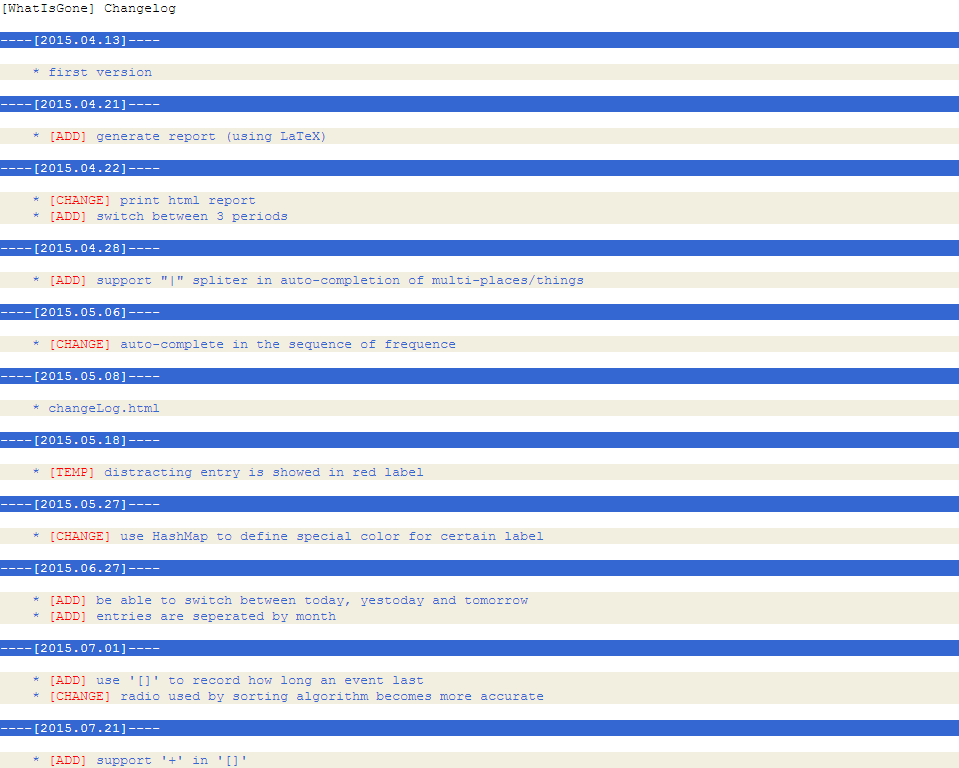
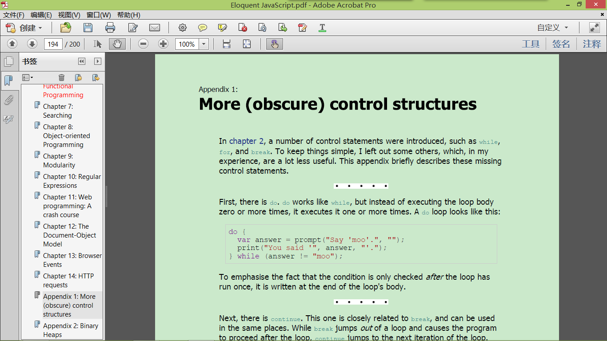
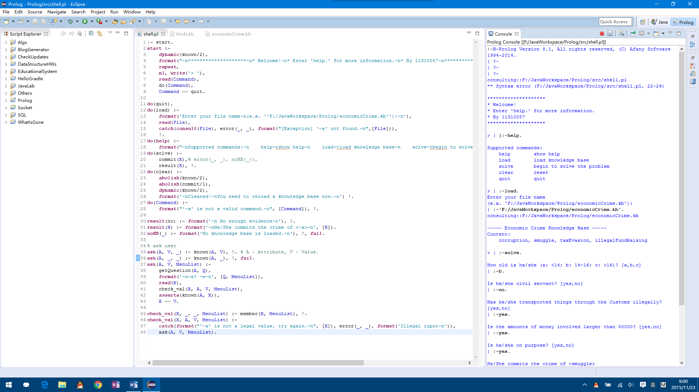
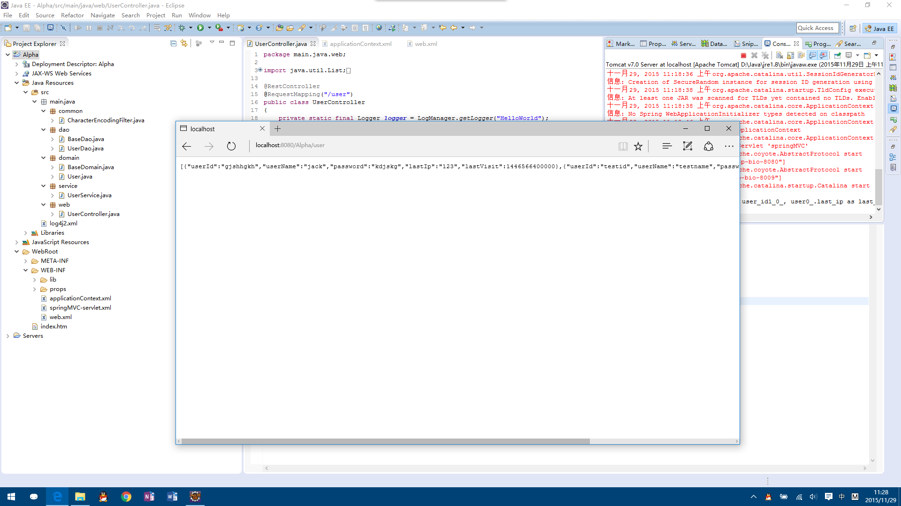

# 2015 Summary

::: tip Repost
Originally posted on 2016-01-25
:::

## Memento

<figure>
    
    <figcaption>App <em>WhatIsGone</em>（Hints:《奇特的一生》《在我入睡前》）</figcaption>
</figure>

<figure>
    
    <figcaption>Unity 3d, my Minecraft (2015-03-12)</figcaption>
</figure>

<figure>
    
    <figcaption><em>Eloquent JavaScript</em> (2015-05-26)</figcaption>
</figure>

<figure>
    
    <figcaption>Building native app using HTML, JavaScript, CSS (2015-05-27)</figcaption>
</figure>

<figure>
    
    <figcaption>Hong Kong (2015-06-14)</figcaption>
</figure>

<figure>
    
    <figcaption><em>Machine Learning</em>, Coursera (2015-06-29)</figcaption>
</figure>

<figure>
    
    <figcaption>SAE, Python, Vim (2015-09-01)</figcaption>
</figure>

<figure>
    
    <figcaption>Prolog project (2015-11-23)</figcaption>
</figure>

<figure>
    
    <figcaption>Spring, Spring MVC, Hibernate (2015-11-28)</figcaption>
</figure>

<figure>
    
    <figcaption>Windows 10 UWP app (2015-12-22)</figcaption>
</figure>

<figure>
    
    <figcaption>Jess project (2016-01-04)</figcaption>
</figure>

<figure>
    
    <figcaption>Beef hotpot (2016-01-21)</figcaption>
</figure>

***“Version control” of myself***

<!-- > Once you can name something, you're conscious of it. You have power over it.
> ⸺The Non-Designer's Design Book, Chapter 1 “The Joshua Tree Epiphany”

There is a hypothesis named [linguistic relativity](https://en.wikipedia.org/wiki/Linguistic_relativity) whose principle holds that the structure of a language affects its speakers' world view or cognition.

Sometimes we solve problems with intuition. Maybe that is because it's too difficult for us to find an accurate word to describe it. Without explicit definition of what we care about, we cannot figure out how to do it, even what to do. (Mathematics is probably the most accurate 'words', no wonder most modern scientific theories are built on top of it.)

There are too many things that I have no concept of, in other words, I can't even name them (I don't know what I don't know). **There is always more knowledge to learn**.

When talked about cognition, the [curse of knowledge](https://en.wikipedia.org/wiki/Curse_of_knowledge) is an interesting cognitive bias. That is, if you know about something, you will be hard to think from the perspective of who don't know that. That is really interesting. Since we know more and more things, maybe you even cannot understand the one you were. ([List of cognitive biases](https://en.wikipedia.org/wiki/List_of_cognitive_biases))

Bias always exists because there are too much we don't know, and in the other hand, we have already known too much.

***Recognizing yourself is really hard***. -->
