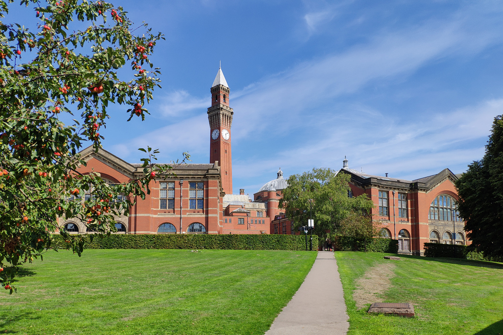
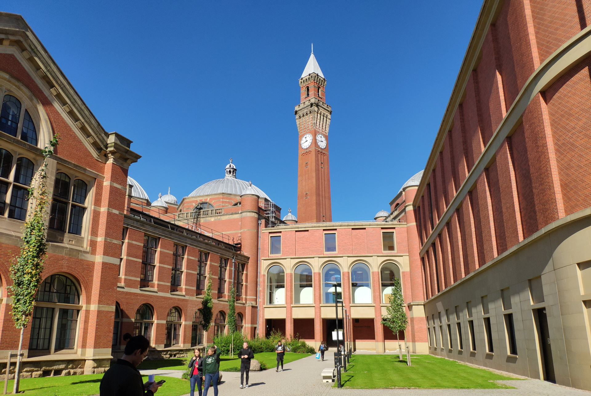
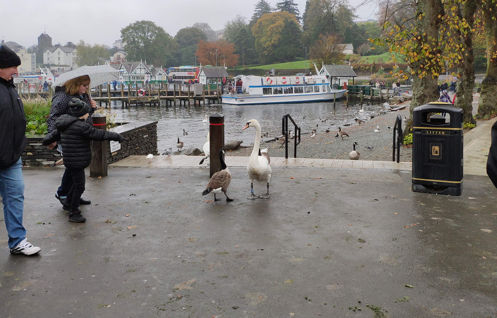
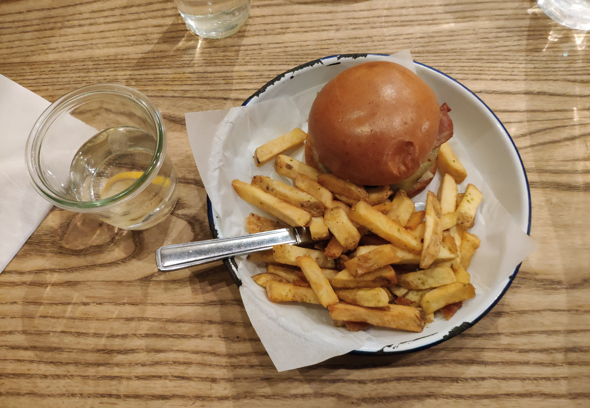
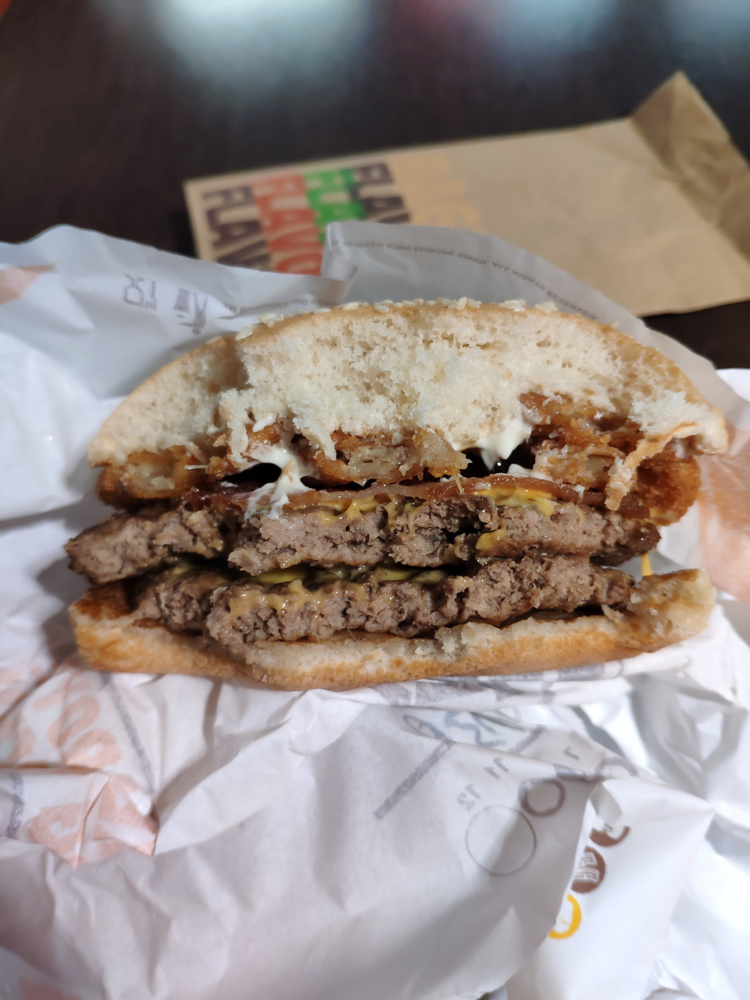
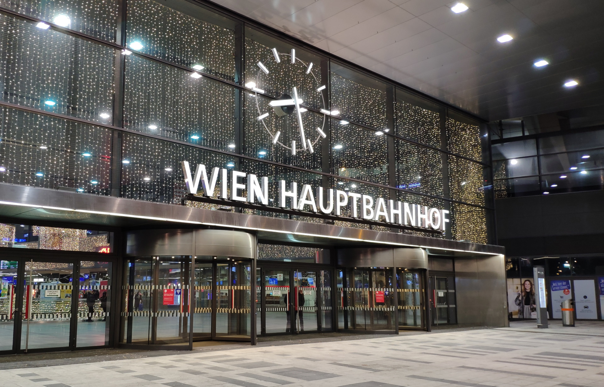
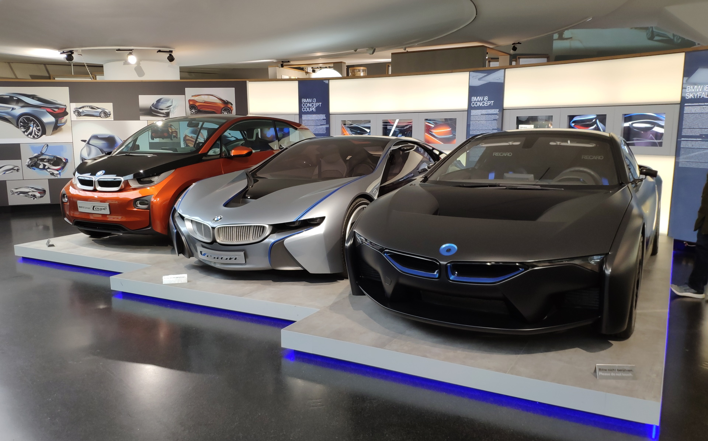
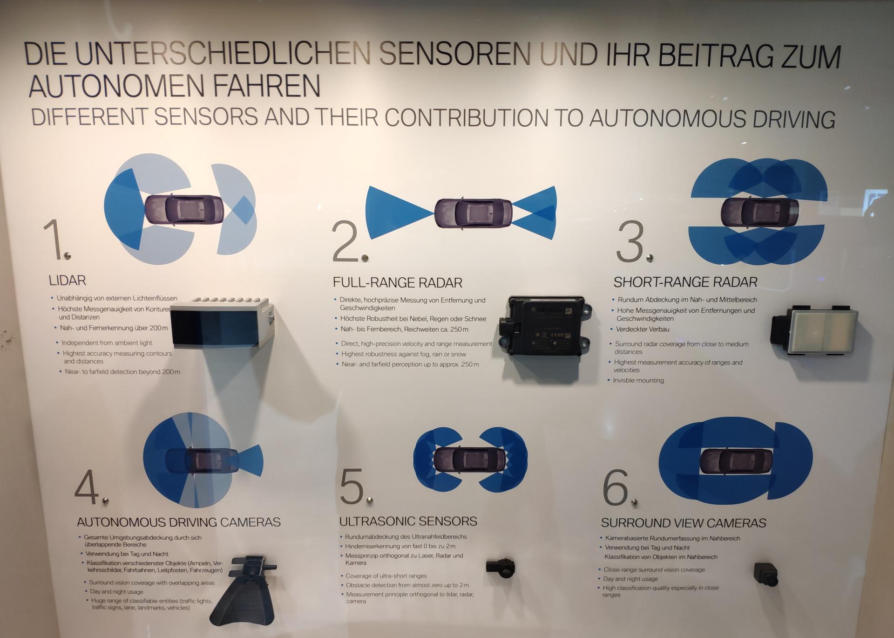
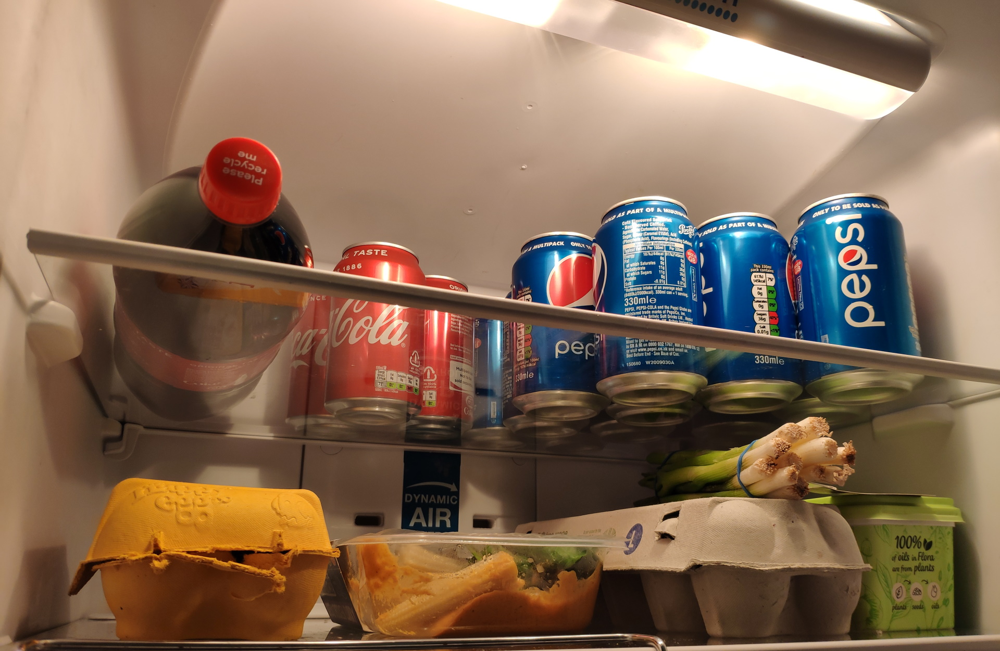
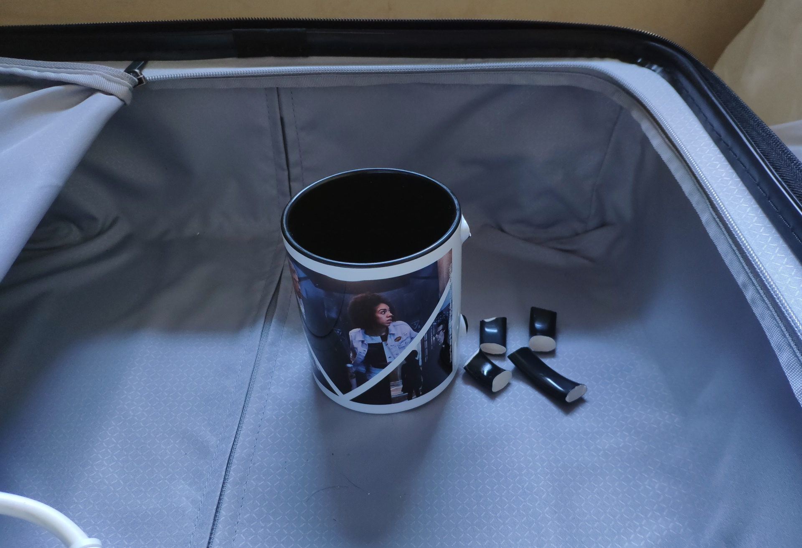

# 2018 in the UK

## 伯明翰

<figure>
    
    <figcaption>Finnair 芬兰航空 (2018-08-30)</figcaption>
</figure>

<figure>
    
    <figcaption>伯明翰大学 (2018-09-01)</figcaption>
</figure>

<figure>
    
    <figcaption>2018-09-06</figcaption>
</figure>

<figure>
    
    <figcaption>2018-09-10</figcaption>
</figure>

<figure>
    
    <figcaption>天是真的蓝，不过纬度高也是重要原因 (2018-09-25)</figcaption>
</figure>

## Lake District

湖区国家公园 2018-10-20

<figure>
    
    <figcaption>「你怎么回事，小老弟」</figcaption>
</figure>

<figure>
    
    <figcaption>排排坐</figcaption>
</figure>

<figure>
    
    <figcaption>手机拍出来效果还是差了不少</figcaption>
</figure>

---

<figure>
    
    <figcaption>帝国战争博物馆 曼彻斯特 (2018-10-21)</figcaption>
</figure>

<figure>
    
    <figcaption>曼大 (2018-10-21)</figcaption>
</figure>

---

<figure>
    
    <figcaption>2018-10-23</figcaption>
</figure>

## 伦敦

<figure>
    
    <figcaption>唐人街 (2018-11-24)</figcaption>
</figure>

<figure>
    
    <figcaption>摄政街 (2018-11-24)</figcaption>
</figure>

<figure>
    
    <figcaption>大英博物馆 (2018-11-25)</figcaption>
</figure>

<figure>
    
    <figcaption>大英博物馆 (2018-11-25)</figcaption>
</figure>

<figure>
    
    <figcaption>刘易斯西洋棋 (2018-11-25)</figcaption>
</figure>

<figure>
    
    <figcaption>Honest Burger (2018-11-25)</figcaption>
</figure>

<figure>
    
    <figcaption>King's Cross 火车站附近 (2018-12-04)</figcaption>
</figure>

<figure>
    
    <figcaption>大英图书馆 (2018-12-04)</figcaption>
</figure>

## 圣诞

<figure>
    
    <figcaption>伯明翰机场的汉堡王 (2018-12-19)</figcaption>
</figure>

<figure>
    
    <figcaption>Hauptbahnhof means "central station" (2018-12-20)</figcaption>
</figure>

<figure>
    
    <figcaption>德式土耳其烤肉 (2018-12-20)</figcaption>
</figure>

<figure>
    
    <figcaption>我忘了 (2018-12-22)</figcaption>
</figure>

<figure>
    
    <figcaption>维也纳 (2018-12-24)</figcaption>
</figure>

<figure>
    
    <figcaption>2018-12-26</figcaption>
</figure>

<figure>
    
    <figcaption>美景宫 (2018-12-27)</figcaption>
</figure>

以及其它很多地方——都忘记拍了

<figure>
    
    <figcaption>偶遇 特劳恩湖 (2018-12-27)</figcaption>
</figure>

<figure>
    
    <figcaption>不知名 (2018-12-27)</figcaption>
</figure>

<figure>
    
    <figcaption>新天鹅堡 (2018-12-28)</figcaption>
</figure>

<figure>
    
    <figcaption>宝马博物馆 慕尼黑 (2018-12-29)</figcaption>
</figure>

<figure>
    
    <figcaption>自动驾驶分级 (2018-12-29)</figcaption>
</figure>

<figure>
    
    <figcaption>传感器 (2018-12-29)</figcaption>
</figure>

---

<figure>
    <video controls width="100%">
        <source src="./imgs/2018/20181231-235949.webm">
    </video>
    <figcaption>Six..Five..Four.. 跨年焰火 爱丁堡 (2018-12-31)</figcaption>
</figure>

<figure>
    
    <figcaption>亚瑟王座山 (2019-01-01)</figcaption>
</figure>

<figure>
    
    <figcaption>爱丁堡 (2019-01-02)</figcaption>
</figure>

---

<figure>
    
    <figcaption>我宣布百事可乐获胜 (2019-01-23)</figcaption>
</figure>

<figure>
    
    <figcaption>懒人福音 (2019-05-18)</figcaption>
</figure>

## 法国

<figure>
    
    <figcaption>塞纳河 (2019-05-24)</figcaption>
</figure>

<figure>
    
    <figcaption>埃菲尔铁塔 塔顶 (2019-05-24)</figcaption>
</figure>

<figure>
    
    <figcaption>卢浮宫 (2019-05-25)</figcaption>
</figure>

<figure>
    
    <figcaption>玻璃金字塔 (2019-05-25)</figcaption>
</figure>

<figure>
    
    <figcaption>2019-05-25</figcaption>
</figure>

<figure>
    
    <figcaption>2019-05-25</figcaption>
</figure>

<figure>
    
    <figcaption>凯旋门 (2019-05-25)</figcaption>
</figure>

<figure>
    <video controls width="360">
        <source src="./imgs/2018/20190525-230040.webm">
    </video>
    <figcaption>埃菲尔铁塔 灯光 (2019-05-25)</figcaption>
</figure>

<figure>
    
    <figcaption>香榭丽舍大街 (2019-05-26) 路中间特意留出位置给凯旋门拍照</figcaption>
</figure>

<figure>
    
    <figcaption>埃菲尔铁塔 凯旋门视角 (2019-05-26)</figcaption>
</figure>

<figure>
    
    <figcaption>巴适 (2019-05-26)</figcaption>
</figure>

<figure>
    
    <figcaption>巴适 2 (2019-05-26)</figcaption>
</figure>

---

<figure>
    
    <figcaption>进货 (2019-07-12)</figcaption>
</figure>

<figure>
    
    <figcaption>2019-07-26</figcaption>
</figure>

<figure>
    
    <figcaption>可口可乐 蜜蜂都不喝 (2019-08-01)</figcaption>
</figure>

<figure>
    
    <figcaption>2019-08-17</figcaption>
</figure>

<figure>
    
    <figcaption>礼物 (2019-08-20)</figcaption>
</figure>

<figure>
    
    <figcaption>结局 (2019-08-30)</figcaption>
</figure>
