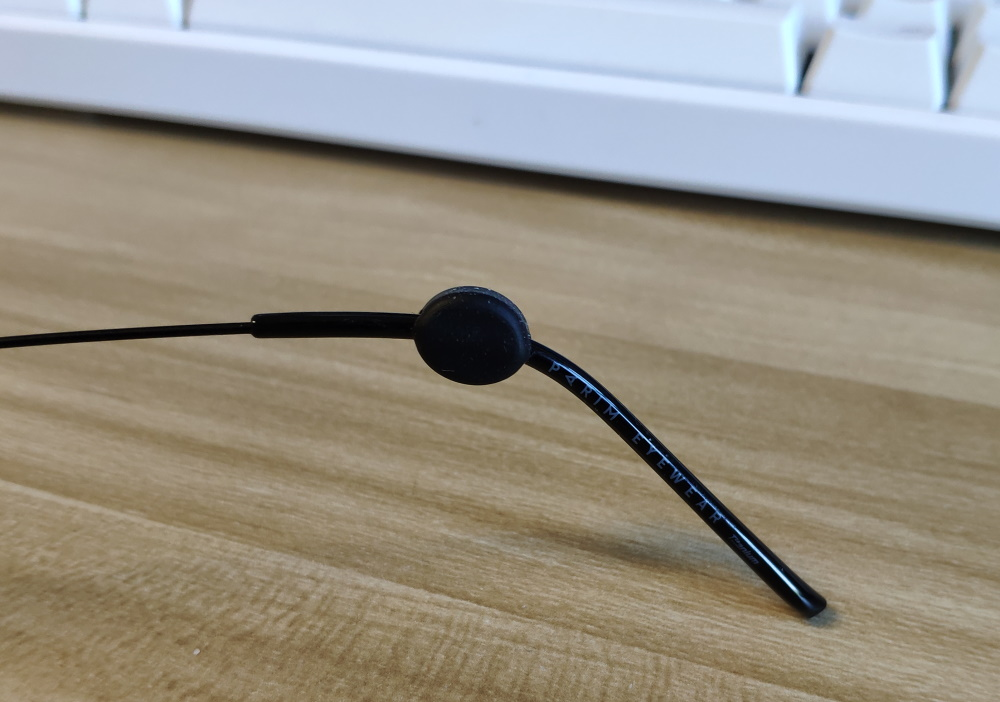

# 配眼镜攻略

## 验光

### 最终需要的数据

- **球镜**：近视或远视的度数
- **柱镜**：散光的度数
- **轴位**：散光的方向
- **瞳距**：左右单瞳距。近用、远用瞳距，这些有则最好，没有影响不大

其它数据就极少用到了

### 好的验光过程

- **电脑验光**：机打验光单，得到一个粗糙的结果
- **综合验光仪**（测最小度数最好视力）：
  - 雾视（通俗解释一下，验光的过程你会有逐渐清晰的感觉）
  - 红绿视标（判断度数会不会过矫）
  - 蜂窝视标
  - ……
- **视功能检查**：比如双眼的远 / 近距离眼位，正负调节能力，调节的快慢，融像的能力
- （**眼疾筛查**）

散瞳不是必须的（一般来说，儿童或青少年的眼睛调节能力很强，需要散瞳验光）

**个人经验**：验光可以选择好的公立医院（用医保很便宜）或者大型的眼镜连锁店。尝试了宝岛眼镜的验光服务，还不错。价格一般都是 50 块，但是广东要 99 😑。从来没做过视功能检查的值得体验一下。

## 镜片

### 参数

最主要的参数就是==折射率==了。折射率越高，最后加工出来的镜片（边缘）就越薄。但是折射率高也有相应的缺点，价格和视觉效果（比如色散，可视范围），所以按照自己的度数选择合适的折射率就好了（下表是一个参考范围）。

|    度数 | 推荐折射率 |
| ------: | :--------: |
|    <300 |    1.56    |
| 300~500 |    1.60    |
| 500~700 |    1.67    |
|    >700 |    1.74    |

另一个常提到的参数是==阿贝数==。阿贝数越大，色散就越小（色散的直观感受就是侧视一个物体的时候边缘会发蓝或者发黄）。阿贝数和折射率是负相关的，所以从视觉感受的角度来说折射率越低越好。另外，折射率 1.56 和 1.67 因为材料本身的限制阿贝数会比其周围折射率偏低。不过说到底阿贝数只是影响镜片的众多因素之一，~~实际上可能感知不出多大差别~~（似乎有一点感知，但是选择余地也不大）。

<figure>
    
    <figcaption>色散 (source: <a href="https://commons.wikimedia.org/wiki/File:Prism-rainbow.svg" target="_blank" rel="noopener noreferrer" class="outbound">Wiki</a>)</figcaption>
</figure>

其它方面，比如**材质**，基本不用多考虑了，最主流的就是树脂（玻璃硬度高，但是重，主要用在高折射率如 1.8 以上）

**折射率与厚度**。按照淘宝网店给的数据，镜框宽度为 49 mm 时，

- 475 度，1.60 折射率：边缘厚 0.34 cm
- 725 度，1.67 折射率：边缘厚 0.40 cm
- 1100 度，1.74 折射率：边缘厚 0.61 cm

实际用这个镜框 + 1.67 镜片加工的结果是 700 度的边缘接近 0.50 cm，475 度的边缘也大约 0.45 cm（厚度其实还受移心量影响，其由镜框尺寸与瞳距决定）。

### 品牌与价格

- 国产：明月，万新等
- 进口：（顶级）蔡司，依视路；（一线）豪雅，尼康

每个品牌还有很多系列，镜片上镀有不同功能的**膜层**，比如增加硬度不易刮花。一般认为的「甜品」系列有 依视路钻晶 A3，蔡司（新）清锐系列。

**价格**：国产标价打 5 折，进口标价 7 折价格就比较合理了（所谓进口实际上也是国内建厂贴牌）

<table>
<thead>
  <tr>
    <th>折射率</th>
    <th>1.56</th>
    <th>1.6</th>
    <th>1.6</th>
    <th>1.67</th>
    <th>1.74</th>
  </tr>
</thead>
<tbody>
  <tr style="text-align: center;">
    <td>阿贝数</td>
    <td>36</td>
    <td>31</td>
    <td>40</td>
    <td>32</td>
    <td>33</td>
  </tr>
  <tr style="text-align: center;">
    <td>依视路钻晶 A3</td>
    <td>780</td>
    <td>990</td>
    <td>1080</td>
    <td>2180</td>
    <td>5000 元 / 对</td>
  </tr>
  <tr style="text-align: center; font-size: 0.6em;">
    <td>双面非球面</td>
    <td></td>
    <td></td>
    <td></td>
    <td>3800</td>
    <td>6800</td>
  </tr>
</tbody>
</table>

**个人经验**：京东自营配镜中心，依视路钻晶 A3 两片 1.67，有活动时可以 880 买到。

眼镜实际到手视觉效果一般般，看显示器屏幕时能感觉到色散的现象（虽然适应一两天后就感知不强了）。可能印证了一种说法「1.67 的材料就注定做不了太好，完全没必要买蔡司依视路」，以后不如考虑凯米或蔡司 A 系列（莲花膜，国内特供，据说不耐磨，但价格低了不少）。

## 镜框

镜框不像镜片那样质量与品牌强相关，重点是主观感受、舒适度，稳定性。多试戴！

### 参数

镜框的参数主要就是尺寸了，一般都会印在镜腿上，比如 52◻17-135，分别表示镜片宽度，鼻梁间距和镜腿长度。高度数的话尽量还是选小框，不然边缘很厚，并且大框没有小框舒服。

### 品牌与价格

> **观点：大牌做工质量好，售后好**
>
> 国内的眼镜架**一线品牌：暴龙，帕莎，陌森，保圣，海伦凯勒**，天猫的价格在四五百左右，眼镜店一般标价翻倍。 **二线品牌：施洛华，李维斯，克莱顿，丘比特，凯岚，花花公子**。天猫价格在二三百左右，眼镜店标价一般在五六百。

> **观点：不要去买其他领域、非眼镜行业领域的眼镜品牌**
>
> 不是说那些品牌的镜架都不好，而是专业生产镜架的品牌是真的专业，比如**夏蒙、林德伯格、ic! berlin、精工、诗乐、LOTOS**（贵）**、派丽蒙**（国产翘楚，但是也涨价了）
>
> **对于选择镜架，任何品牌都没有亲自试戴靠谱。**

**个人经验**：线下镜框暴利啊，选择也不如网上多。网上挑了 JINS 和派丽蒙的两幅镜框试试（最后选择了派丽蒙的钛架，确实非常轻，鼻托也是金属的，好评）。

另外张大妈上有很多海淘 JINS 的经验分享帖，优势在于可以便宜配到高折射率的豪雅镜片，但是劣势是配套的镜框往往大、重，好的镜框少而且要加钱，基本把优势抵消了。

## 到手之后

拿到眼镜之后，除了检查各种光学参数是否正确之外，还有一些影响舒适度的细节值得注意。

- **鼻托**
  即使是新眼镜，鼻托也很可能不太对称，记得从多个角度观察一下，到眼镜店一般都可以免费调整（也可以自己掰）。

- **耳位**
  人本身其实也不是左右完全对称的，一个常见的情况是左右耳的高度不一样，眼镜戴上会歪。我的旧眼镜反倒是适应成了合适的高度，但是因为太久远已经记不清是人工调整过还是经年累月的磨合。

  <figure>
      
  </figure>

  解决办法是找眼镜店的师傅帮忙调整一下镜腿高度（耳朵高的一边镜腿调高），但是这种方法有一点粗暴。此外可以考虑淘宝搜索「耳托」

  <figure>
      
  </figure>

新眼镜可能需要几天适应，因人而异。但是如果不适超过一周，还是重新检查一下为好。

## 参考材料

- [一个好的验光过程应该是怎样的？](https://zhuanlan.zhihu.com/p/166298197)，[一个标准的验光流程](https://zhuanlan.zhihu.com/p/30571542) - 知乎专栏
- [配眼镜你吃过哪些亏？- 知乎](https://www.zhihu.com/question/318306672)
- [眼镜有点道 - 知乎专栏](https://www.zhihu.com/column/freeview)
- [眼镜选购终极攻略 - 知乎专栏](https://zhuanlan.zhihu.com/p/78501180)
