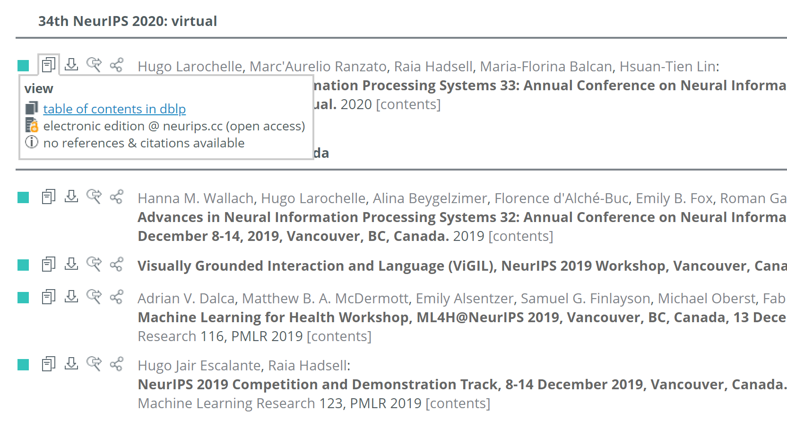

# Literature Review the Hard Way

寻找和自己领域相关的文章应该算是个永恒的需求了，不论是为了文献调研还是为了追踪每年会议期刊新发表的大量论文。

## 顺藤摸瓜式

从本质上说这无非是一个**搜索问题**，最常见的方式即为：从一些 seed 文章开始，定位到其中 related work 部分，顺藤摸瓜找到更多的文章。其中挑选 seed 文章有如下偏好：

- 如果有现成的综述文章当然好
- 时间上最近的文章比旧的文章好

## Brute-force

但是——如果想搜索的关键词很宽泛，或者某领域还未 well-defined，那还可以考虑一下暴力搜索。为了不那么暴力，还需要下面两个工具：

- [**dblp**](https://dblp.uni-trier.de/) **计算机文献数据库**

  它最好的地方在于把各个会议期刊的论文列表都整理出来了，并且是一个个完整的页面（不分页或者懒加载），便于一次性查找关键词

  

- [**find+**](https://chrome.google.com/webstore/detail/find%20-regex-find-in-page/fddffkdncgkkdjobemgbpojjeffmmofb?hl=en) **正则搜索与高亮**（Chrome 插件）
  
  然后就可以使用 `(keyword1|keyword2|...)` 的正则表达式搜索啦。搜索出结果之后再点 Persistent Highlights（建议不要在搜索之前开启），就可以粗筛出可能感兴趣的文章了

  

先列出自己关注的顶会顶刊，再搜集一些关键字，就可以挨个搜索了。热门的领域每年产出的文章数量还是很多的，工作量不小，之后就是漫长的读论文时间了。
