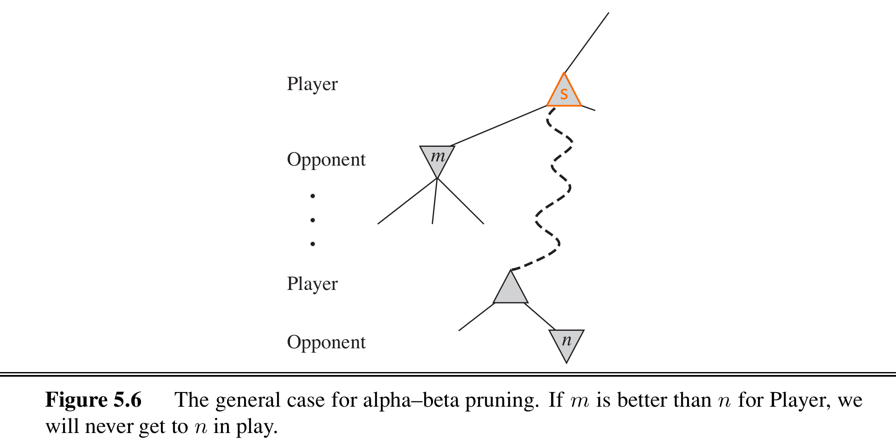

# Minimax

<link rel="stylesheet" href="/notes/katex@0.11.1.min.css">

Minimax 算法常用于「有限状态，零和，完全信息，两人」博弈问题，比如棋类

## 问题定义

- ==状态== **state**，$s \in S$（棋盘的局面）
- ==允许的动作== **actions**，$A(s)$（即可以落子的点）
- The ==transition model== $t(s, a) \colon S \times A \to S$（比如黑白棋的翻转，围棋的提子）

这三者（其实也就是游戏规则）决定了 **game tree**

<figure>
  
  <figcaption>A branch of a game tree. (source: <a href="https://www.5dchesswithmultiversetimetravel.com/">5D Chess With Multiverse Time Travel</a>)</figcaption>
</figure>

- ==效用函数==，**utility function**: $u(s,p)$，（玩家 $p$）在游戏结束时（状态 $s$）获得的「收益」
- 玩家需要的是一个==策略==，**strategy**，即在给定状态（棋局）下选择一个动作（落子）

## Minimax 算法

在零和博弈的设定下，玩家一的目标为最大化自己的收益 $\max u_1$，玩家二的目标则等价于最小化玩家一的收益 $\min u_1$，方便起见分别称为 Max 和 Min。给定一个 game tree，最优策略可以由每个节点的 **minimax 值**决定

- ==Minimax 值==，一个递归定义的值，表示从当前状态 $s$ 开始，双方均采取最优策略直至游戏结束时玩家一（Max）的**效用值**
  $$
  \text{minimax}(s) = \begin{cases}
    u(s, \texttt{Max})                         & \text{if GameOver}(s) \\
    \max_{a \in A(s)} \text{minimax}(s^\prime) & \text{if }\texttt{Max}\text{'s turn} \\
    \min_{a \in A(s)}\text{minimax}(s^\prime) & \text{if }\texttt{Min}\text{'s turn} \\
  \end{cases}
  $$
  其中 $s^\prime=t(s,a)$

从上述定义中不难看出，计算 minimax 值时需要沿着 game tree 一直推演（深度优先）至叶子节点（游戏结束），然后回溯计算出之前每个节点的值。一个节点只要计算出了 minimax 值，就已经看到了游戏的结局（效用值），假设对手（Min）也采取最优策略的话。而如果 Min 不采取最优策略，Max 仍然采取 minimax 策略，Max 的最终效用只会更高（不一定最优）。

假设 game tree 的深度为 $m$，每个节点有 $b$ 种走法，则该算法的时间复杂度为 $O(b^m)$，在实际情况中是不现实的。

::: details Python 代码
```python
## https://github.com/aimacode/aima-python/blob/master/games.py

def minmax_decision(state, game):
    """Given a state in a game, calculate the best move by searching
    forward all the way to the terminal states. [Figure 5.3]"""

    player = game.to_move(state)

    def max_value(state):
        if game.terminal_test(state):
            return game.utility(state, player)
        v = -np.inf
        for a in game.actions(state):
            v = max(v, min_value(game.result(state, a)))
        return v

    def min_value(state):
        if game.terminal_test(state):
            return game.utility(state, player)
        v = np.inf
        for a in game.actions(state):
            v = min(v, max_value(game.result(state, a)))
        return v

    # Body of minmax_decision:
    return max(game.actions(state), key=lambda a: min_value(game.result(state, a)))
```
:::

## Alpha-Beta 剪枝

假设我们当前处于 $s$ 节点，并且已经计算出了其一个**直接子节点** $m$ 的 minimax 值，那么对于 $s$ 的其它**后代节点**，如果 $n$「差于」$m$，那么 $n$ 节点肯定不是最优路线了

<figure>
  
  <figcaption>Alpha-beta 剪枝原理</figcaption>
</figure>

具体来说，对于一个 Max 节点（例如 $s$），每计算出一个子节点 $m_i$ 都会更新 $s$ 的下限（$s \ge \alpha$），其中 $\alpha=\text{max}(m_1,m_2,\dots)$。在 $s$ 还未探索的后代节点中，如果能够确定某个节点 $n\le\alpha$，也就表明其肯定不是最优解，可以剪掉（无需再考察 $n$ 的其它子节点）。而想要确定 $n\le\alpha$，需要两个条件：$n$ 是 Min 节点，$n$ 的一个子节点 $n^\prime\le\alpha$。

同理，假如 $s$ 是 Min 节点，已知的子节点会确定 $s$ 的上限（$s \le \beta$），$\beta=\text{min}(m_1,m_2,\dots)$。剪枝只会发生在其后代的某个 Max 节点 $n$，如果发现 $(n\ge)\,n^\prime\ge\beta$。

每个节点的 $\alpha$，$\beta$ 值继承于它的父节点。

::: details Python 代码
```python
## https://github.com/aimacode/aima-python/blob/master/games.py

def alpha_beta_search(state, game):
    """Search game to determine best action; use alpha-beta pruning.
    As in [Figure 5.7], this version searches all the way to the leaves."""

    player = game.to_move(state)

    # Functions used by alpha_beta
    def max_value(state, alpha, beta):
        if game.terminal_test(state):
            return game.utility(state, player)
        v = -np.inf
        for a in game.actions(state):
            v = max(v, min_value(game.result(state, a), alpha, beta))
            if v >= beta:
                return v
            alpha = max(alpha, v)
        return v

    def min_value(state, alpha, beta):
        if game.terminal_test(state):
            return game.utility(state, player)
        v = np.inf
        for a in game.actions(state):
            v = min(v, max_value(game.result(state, a), alpha, beta))
            if v <= alpha:
                return v
            beta = min(beta, v)
        return v

    # Body of alpha_beta_search:
    best_score = -np.inf
    beta = np.inf
    best_action = None
    for a in game.actions(state):
        v = min_value(game.result(state, a), best_score, beta)
        if v > best_score:
            best_score = v
            best_action = a
    return best_action
```
:::

::: tip
即使使用了 alpha-beta 剪枝，在实际中也基本不可能搜索到游戏结束，这就需要使用**启发式**==评估函数==（heuristic evaluation function）来代替游戏最终的效用函数，这里不再展开。
:::

## 阅读材料

- Russell, Stuart, and Peter Norvig. Artificial Intelligence: A Modern Approach. *Prentice Hall*. 3rd 2009. (Chapter 5: Adversarial Search)

扩展阅读

- ⭐ [浅述：从 Minimax 到 AlphaZero，完全信息博弈之路](https://zhuanlan.zhihu.com/p/31809930)
