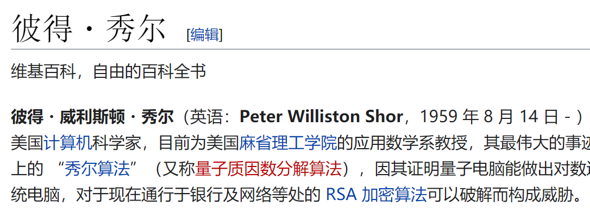

# 无题

### 2021.05.26

<figure>
  
  <figcaption><a href="https://marketplace.visualstudio.com/items?itemName=tonybaloney.vscode-pets" target="_blank" rel="noopener noreferrer" class="outbound">VS Code Pets</a></figcaption>
</figure>

### 2021.03.10

<figure>
    
</figure>

### 2021.01.19

<figure>
    
</figure>

### 2020.12.07

> No code is the best way to write secure and reliable applications. Write nothing; deploy nowhere.
>
> [No Code](https://marketplace.visualstudio.com/items?itemName=writenothing.no-code) - VS Code Marketplace - **5,825,050** installs (in 4 days)
> Trivia: Markdown All in One has 1,981,617 installs.

### 2020.12.06

<figure>
    
</figure>

### 2020.11.30

<figure>
    
</figure>
