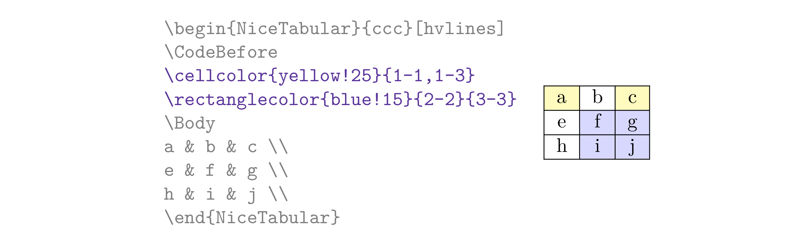

# 好用的 LaTeX 表格：`nicematrix` 包

::: tip CTAN 链接
<https://ctan.org/pkg/nicematrix>
:::

## 基本用法

```latex
\usepackage{nicematrix}
```

使用 `\Block` 创建单元格，可跨行、跨列、换行，还有可选参数比如 `l`，`c`，`r`（横向对齐），`fill`，`draw`（颜色）等等。

```latex
\begin{NiceTabular}{ccc}[hvlines]
                       & \Block{1-2}{Multi-column}        \\
\Block{2-1}{Multi-row} & John  & Steph                    \\
                       & Sarah & \Block{}{A line\\ break} \\
\end{NiceTabular}
```

<figure>
  
</figure>

## 表格脚注

```latex
\usepackage{enumitem} % 依赖
\usepackage{booktabs} % \toprule etc.
```

```latex
\begin{NiceTabular}{llr}[first-row,code-for-first-row=\bfseries]
\toprule
Last name & First name & Birth day       \\
\midrule
Achard\tabularnote{A note.}
          & Jacques    & 5 juin 1962     \\
Lefebvre\tabularnote{Another note.}
          & Mathilde   & 23 mai 1988     \\
Vanesse   & Stephany   & 30 octobre 1994 \\
Dupont    & Chantal    & 15 janvier 1998 \\
\bottomrule
\end{NiceTabular}
```

<figure>
  
</figure>

## 单元格背景色

```latex
\begin{NiceTabular}{ccc}[hvlines]
\CodeBefore
\cellcolor{yellow!25}{1-1,1-3}
\rectanglecolor{blue!15}{2-2}{3-3}
\Body
a & b & c \\
e & f & g \\
h & i & j \\
\end{NiceTabular}
```

<figure>
  
</figure>

## 边框

```latex
\NiceMatrixOptions{cell-space-top-limit=3pt}
\begin{NiceTabular}{*{6}{c}}[corners,hvlines]
& & & & A \\
& & A & A & A \\
& & & A \\
& & A & A & A & A \\
A & A & A & A & A & A \\
A & A & A & A & A & A \\
& A & A & A \\
& \Block{2-2}{B} & & A \\
& & & A \\
\end{NiceTabular}
```

<figure>
  
</figure>
