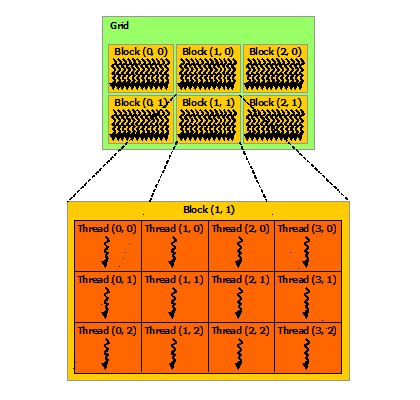

# 加速计算基础──CUDA Python 编程

::: callout
💡　某程序员遇到了一个问题，打算用并行来解决它──现他在有个两问题了。
:::

本文大部分内容来自 NVIDIA Deep Learning Institute

## Numba 简介

> Numba 是一个**支持类型特化**的**即时** **函数编译器**，用于为 CPU 或 GPU 加速**以数字计算为主的** Python 函数。此定义很长，下面就让我们逐一解析这些术语：
>
> - **函数编译器**：Numba 用于编译 Python 函数，而非整个应用程序，亦不定义函数。Numba 不会取代 Python 解释器，而仅作为另一个 Python 模块，将普通函数转化为执行速度更快的函数（通常情况下）。
> - **类型特化**：Numba 可为您当前使用的特定数据类型生成专门的执行代码，从而加速函数运行。Python 函数专为处理通用数据类型而设计，这为其带来了极大的灵活性，但也严重拖慢了运行速度。实际上，您只需调用具有少量参数类型的函数，即可让 Numba 为每个类型组生成快速执行代码。
> - **即时**：Numba 在函数首次被调用时即会开始编译函数。确保编译器了解您将使用的参数类型。此特性还支持在 Jupyter Notebook 中以交互方式使用 Numba，正如使用传统应用程序一样简单。
> - **以数字计算为主**：Numba 目前以处理基本数据类型为主，如 `int`、`float` 和 `complex`。字符串处理支持极为受限，且许多字符串处理函数还无法在 GPU 上获得有效加速。若要借助 Numba 获得最佳加速效果，您可能需要搭配使用 NumPy 数组。

CUDA 编程方式包括

- **CUDA C/C++**（最高效、灵活）
- **PyCUDA**（完全对接 CUDA C/C++，性能次佳，不过需编写 C 代码，通常还要修改 Python 代码）
- **Numba**（Python 最友好，也能为 CPU 加速）

`@jit` `@njit` 加速 CPU（实时编译成机器码）

`@vectorize`（GPU 并行，ufunc）

::: tip Best Practice
尽量减少 CPU (Host) 和 GPU (Device) 间的数据传输，即便与 CPU 相比，在设备上运行某些核函数并未实现性能提升时，也需遵照此规则

[CUDA Best Practices Guide](https://docs.nvidia.com/cuda/cuda-c-best-practices-guide/index.html)
:::

`@cuda.jit`

`cuda.to_device` `copy_to_host()`

## 自定义 CUDA 核函数

### 线程结构

- ==Thread==，GPU 工作的最小单元
- ==Block==，由多个 thread 组成，拥有**共享内存**
- ==Grid==，由多个 block 组成，是 GPU 上的函数（即核函数）执行的单元

<figure>
    
    <figcaption>Thread hierarchy. <a href="https://docs.nvidia.com/cuda/cuda-c-programming-guide/index.html#thread-hierarchy" target="_blank" rel="noopener noreferrer">source</a></figcaption>
</figure>

`cuda.gird`

`cuda.gridsize`

### 原子操作

`cuda.atomic.*`

## CUDA 多维网格与共享内存
