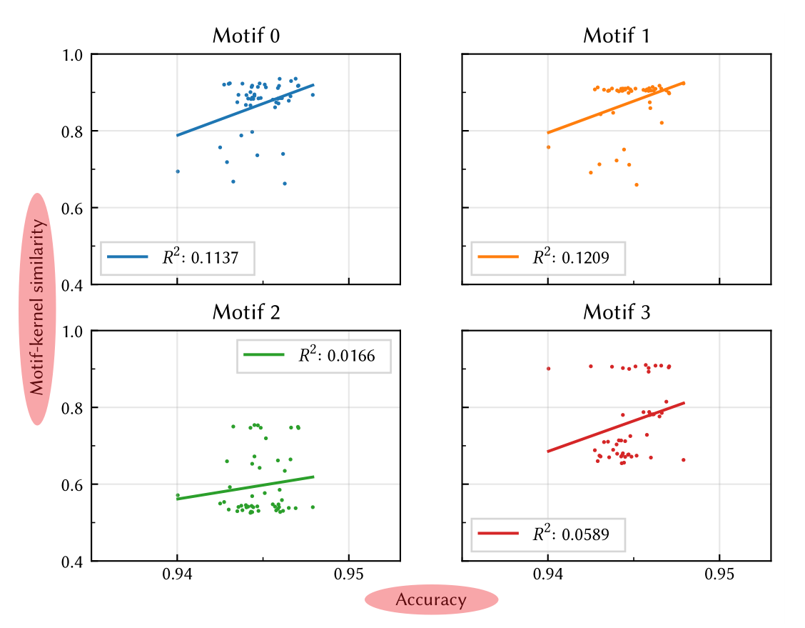

# Matplotlib

## 基本概念：Figure 与 Axes

<figure>
  
  <figcaption>A <code>Figure</code> with 2 <code>Axes</code></figcaption>
</figure>

- `Figure` 代表了整张图片 (`figure.savefig`)，像一个容器（可以设置 `figsize`，`dpi` 等）
- `Axes` 则包括了**真正要画的内容**，比如坐标轴、折线、文本

Matplotlib 提供了两套 API：
- `pyplot` API，模仿 MATLAB 的语法风格，适合临时画图（一通 `plt.xxx` 搞定），
- 面向对象风格的 API，显式地操作上述 `Figure`，`Axes` 对象，便于进行细节的控制和管理，特别是代码需要重复使用的时候。

前者 `plt.xxx` 相当于始终在「当前的」`Figure` 或 `Axes` 对象上操作，与 `ax.xxx` 或者 `ax.set_xxx` 相对应。

```python
import matplotlib.pyplot as plt

## 默认一个 Axes
fig, ax = plt.subplots()
ax.plot(x, y)
fig.savefig("out.png")

## ==================

## 多个 Axes，两行一列
fig, (ax1, ax2) = plt.subplots(2, 1)  ## 使用 `constrained_layout=True` 避免 Axes 重叠

ax1.plot(x1, y1)
ax1.set_title("Axes 1")

ax2.plot(x2, y2)
ax2.set_title("Axes 2")

fig.suptitle("Figure")
fig.savefig("out.png")
```

---

::: tip
<https://github.com/matplotlib/cheatsheets>
:::

## 配置 (Configuration)

配置文件

```python
import matplotlib
print(matplotlib.matplotlib_fname())
## 'C:\Users\<username>\Miniconda3\lib\site-packages\matplotlib\mpl-data\matplotlibrc'

## User-level config file:
## 'C:\Users\<username>\.matplotlib\matplotlibrc'
```

可以用来设置**默认字体**

::: warning
**新安装的字体**可能会找不到，删掉 `$HOME\.matplotlib\fontlist-*.json` 缓存文件即可
:::

在程序中也可以进行配置，比如

```python
plt.rc("text", usetex=True)
plt.rc("font", family="serif")
plt.rc("font", **{"sans-serif": "Consolas"})
```

一些默认值

```
figure.figsize : 6.4, 4.8  ## figure size in inches
font.size      : 10        ## default 'medium' size (all relative values: xx-small, x-small,
                           ## small, medium, large, x-large, xx-large, larger, or smaller)
```

## 刻度 (Ticks)

总的来说，可以使用 [`matplotlib.axes.Axes.tick_params`](https://matplotlib.org/stable/api/_as_gen/matplotlib.axes.Axes.tick_params.html) 方法来控制刻度的方向，颜色，大小等等

### 让 x, y 轴等刻度

```python
# plt.axis("equal")
## 一般来说上面的用法就够了，但是如果同时对 xlim, ylim 有要求的话，下方的用法更准确
plt.gca().set_aspect("equal", adjustable="box")
```

### 主、副刻度 (Major and minor ticks)

```python
from matplotlib.ticker import MultipleLocator

ax = plt.gca()
ax.xaxis.set_major_locator(MultipleLocator(20))
ax.xaxis.set_minor_locator(MultipleLocator(5))
# 使用下面一行来显示副刻度的标签 (minor tick labels)
# ax.xaxis.set_minor_formatter(FormatStrFormatter('%d'))
```

## Colormap

### Colormap 与 Mappable

- `Colormap` 用来把 [0, 1] 数值转化成 RGBA 颜色值
  - 比如可以直接使用 [`matplotlib.colors.Colormap.coolwarm(X)`](https://matplotlib.org/stable/api/_as_gen/matplotlib.colors.Colormap.html#matplotlib.colors.Colormap.__call__) 进行转换
- `Mappable` 则可以对 `Colormap` 进行放缩（借助 `Normalize`）
  - 然后使用 [`mappable.to_rgba(X)`](https://matplotlib.org/stable/api/cm_api.html#matplotlib.cm.ScalarMappable.to_rgba) 进行转换

```python
from matplotlib.cm import ScalarMappable
from matplotlib.colors import Normalize

## The default colormap assumes range [0, 1]. `ScalarMappable` allows custom range.
mappable = ScalarMappable(Normalize(-1, 1), "bwr")
## Don't know why but `set_array` may be needed
## https://stackoverflow.com/a/49036899/8682688
# mappable.set_array(np.array([...]))

certain_patch.set_color(mappable.to_rgba(value))

plt.colorbar(mappable)
```

### 使 Colorbar 刻度为整数

```python
from matplotlib.ticker import MaxNLocator

bar = fig.colorbar()
bar.locator = MaxNLocator(integer=True)
bar.update_ticks()

## 如果是坐标轴的话
# plt.gca().yaxis.set_major_locator(MaxNLocator(integer=True))
```

### 使 Colorbar 和作图区域等高

```python
im = plt.imshow()  ## ...
plt.colorbar(im, fraction=0.046, pad=0.4)
```

不知道原理但是很神奇（[更多讨论](https://stackoverflow.com/a/26720422)）

## Subplots

[Matplotlib demo](https://matplotlib.org/3.1.1/gallery/subplots_axes_and_figures/subplots_demo.html)

<figure>
  
  <figcaption><a href="https://stackoverflow.com/a/53172335/8682688" target="_blank" rel="noopener noreferrer" class="outbound">Shared xlabel/ylabel</a></figcaption>
</figure>

```python
import matplotlib.pyplot as plt

fig, axes = plt.subplots(2, 2, sharex=True, sharey=True)
## add a big axis, hide frame
fig.add_subplot(111, frameon=False)
## hide tick and tick label of the big axis
plt.tick_params(labelcolor='none', which='both', top=False, bottom=False, left=False, right=False)

## 保存为 pgf 格式时 labelcolor 不生效，需要额外添加下面两行
# plt.xticks([0], [" "])
# plt.yticks([0], [" "], rotation="vertical", fontsize="xx-large")

plt.xlabel("common X")
plt.ylabel("common Y")
```

## Default Color Cycle

```python
prop_cycle = plt.rcParams["axes.prop_cycle"]
colors = prop_cycle.by_key()["color"]
```

<code style="color: white; background: #1f77b4;">#1f77b4</code> <code style="color: white; background: #ff7f0e;">#ff7f0e</code> <code style="color: white; background: #2ca02c;">#2ca02c</code> <code style="color: white; background: #d62728;">#d62728</code> <code style="color: white; background: #9467bd;">#9467bd</code>

## PGF 格式与 LaTeX

Matplotlib 可以导出 pgf 格式的图片，其本质是一系列 tex 命令。使用 pgf 格式可以让图片中的文本使用当前 LaTeX 文档所用的字体，从而保持一致。

```python
plt.savefig("example.pgf")
```

在此之前可以使用 `fig.set_size_inches(w=4, h=3)` 来调整图像画布大小

```latex
\usepackage{pgf}

\begin{document}

\begin{figure}
    \centering
    \input{example.pgf}
\end{figure}

\end{document}
```

可以使用 `\resizebox{0.6\textwidth}{!}{\input{example.pgf}}` 来整体缩放图像
