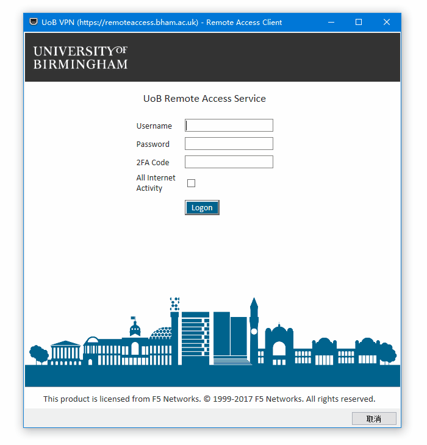

# AutoHotkey

## Hotkeys 和 Hotstrings

```
;;; Hotkeys 脚本结构 ;;;

^j::        ; 快捷键写在 `::` 之前
Send, Hello ; 要执行的命令
return      ; 结束命令

;;; Hotstrings ;;;

::ftw::Free the whales  ; 输入 "ftw" 就会自动展开为 "Free the whales"
```

`.ahk` 脚本编译成 `.exe` 文件之后就不依赖 AutoHotkey 了

## 实例

### 自动填写表单

```
#IfWinActive, ahk_class YourWinClass  ; 可以用附带的 Window Spy 程序查看各个窗口的 WindowClass 值
!f::
; 切换英文输入法 https://www.autohotkey.com/docs/commands/PostMessage.htm#ExSwitchKeybLang
PostMessage, 0x50, 0, 0x4090409,, A
SendRaw ********  ; Username
Send {Tab}
SendRaw ********  ; Password
Send {Tab 2}
Send {Space}
Send +{Tab}
return
; #IfWinActive    ; Endif if needed
```


